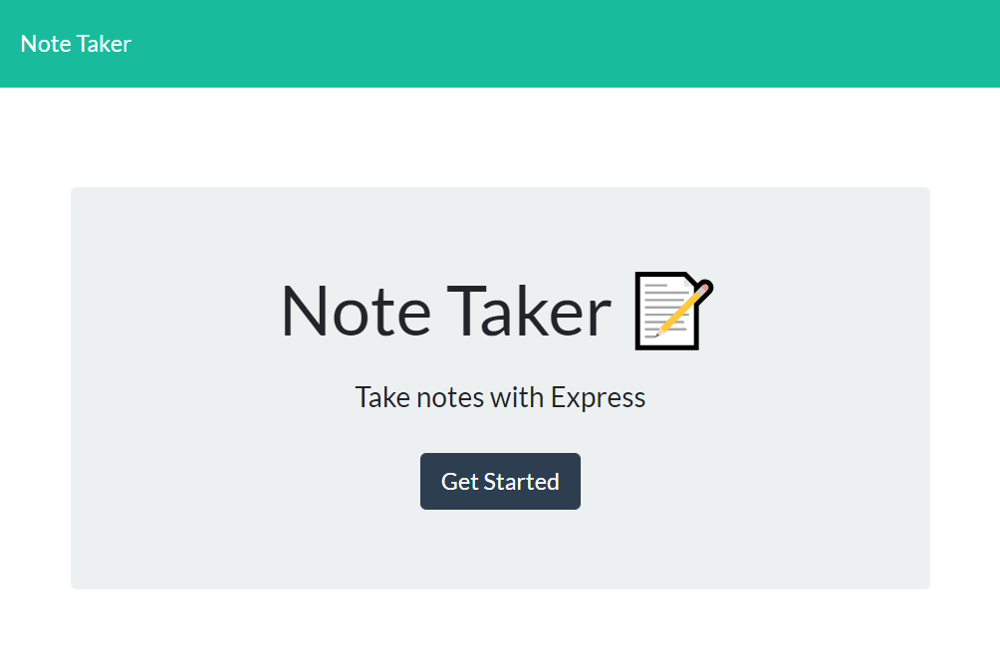
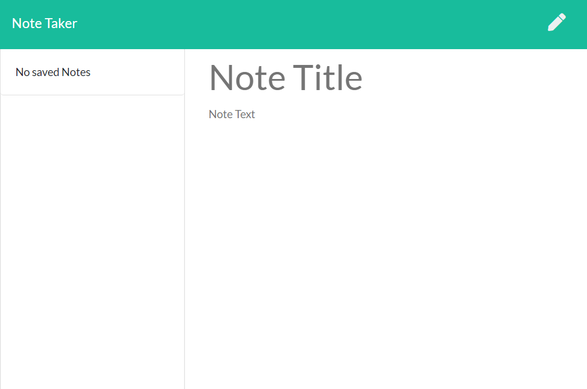

# Note_Taker

## User Story

This is a note taker app that were built for note taking. The users are able to keep track of their notes by interacting with the main page.

## Description

The user will download this repo to their local machine. Run node and start the the server. After the server is running, open a browser and input localhost:3001 on the address. This will take the user to the Note Taker page.

